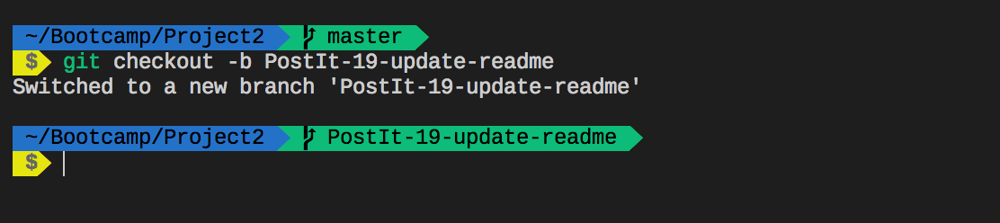
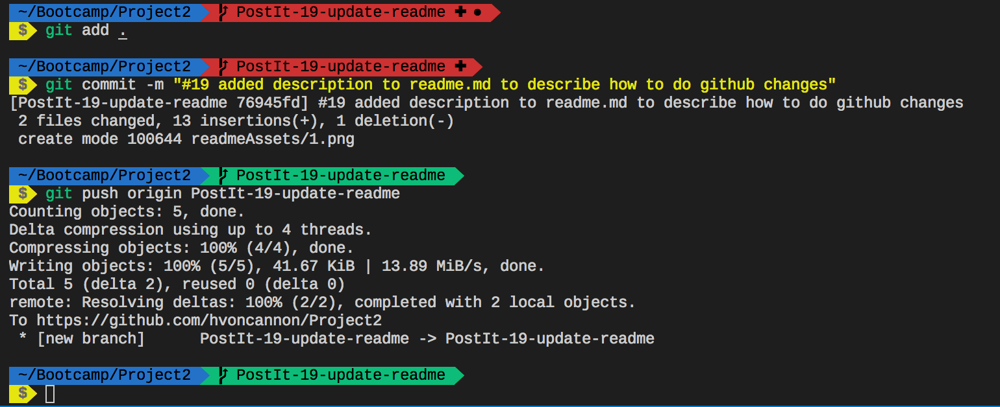

# Team Snowstorm
## Our Team:
* Hayden VonCannon
* Marvie Solis
* Jason Hong
* Eddie Borja
* Jonathan Mai
* Fletcher Bunales

## Who's Down Project

### Project Description:
Who's Down is a website where people can find or create events in their area. Anyone can head to the website, share their location, and see events or meet-ups in their area. The events will be split up across different categories, such as cycling, board gaming, basketball, poker, etc. 

You will be able to login to the site using either your Google or Facebook account. When logged in, you are able to join or create an event. Each event detail page will have a map (using a mapping API) showing the location of the event, a description for the event written by the event creator, a list of attendees, and a comments section. Once you join an event, you will be able to post comments for the event. 

Once an event date has passed, the event page will be deleted in 24 hours; this prevents a category from being cluttered with past events that you can no longer join. Whenever you head to Who's Down, you will quickly be browsing the latest upcoming events in your area for all of your favorite hobbies!

### How To Check Out Branches and Push Code
1. Navigate to our Project Board and find your issue #
2. Go back to terminal and run a 'git checkout -b WhosDown-issueNumGoesHere-quick-description'
    * Example: 'git checkout -b WhosDown-19-update-readme'
    * 
3. Make your changes
4. When you're ready to commit follow these steps:
    1. Run 'git add .' to add all your changes
    2. Run 'git commit -m "#issueNumber with description of what you did afterwards"'
        * This step is important, if you dont add your issue number then github won't recognize the commit and display the commit message on github
    3. Push your changes 'git push origin branchName'
    * 
5. If you have any questions or are skeptical about something, ask Jonathan :D